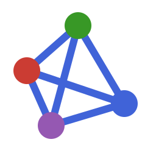

# NetworkCore.jl


[](https://github.com/statistical-network-analysis-with-Julia/NetworkCore.jl)
[](https://github.com/statistical-network-analysis-with-Julia/NetworkCore.jl/actions/workflows/CI.yml?query=branch%3Amain)
[](https://statistical-network-analysis-with-Julia.github.io/NetworkCore.jl/dev/)
[](https://julialang.org/)
[](https://opensource.org/licenses/MIT)

<p align="center">
  
</p>

Core network data structures for the StatNet Julia ecosystem.

## Overview

NetworkCore.jl provides the foundational `Network{T}` type that serves as the base data structure for all other StatNet Julia packages. It implements the Graphs.jl `AbstractGraph` interface while adding support for vertex, edge, and network-level attributes.

This package is a Julia port of the R `network` package from the StatNet collection.

## Installation

Requires Julia 1.12+.

```julia
using Pkg
Pkg.add(url="https://github.com/statistical-network-analysis-with-Julia/NetworkCore.jl")
```

The examples in this README and in the guides also use four registered
packages: Graphs.jl (Graphs.jl algorithms, `SimpleGraph`), DataFrames.jl
(`as_dataframe` and `network_from_dataframe`, which live in a package
extension), CSV.jl (reading the edge-list files the I/O guide writes) and
StatsAPI.jl (the `coef`/`vcov` verbs on the Shared Inference page). Add them
in the same environment:

```julia
Pkg.add(["Graphs", "DataFrames", "CSV", "StatsAPI"])
```

For development of the whole ecosystem, the website's
[workspace guide](https://statistical-network-analysis-with-julia.github.io/getting-started/)
prepares side-by-side clones with `tools/prepare_workspace.jl`.

## Features

- **Network type**: `Network{T}` implementing `AbstractGraph` interface
- **Attributes**: Vertex, edge, and network-level attribute storage
- **Missing data**: a missing-dyad mask marking ties whose status is
  unobserved (statnet-style NA ties), and the ecosystem contract around it:
  every SNA measure, every adapter into another representation
  (`DynamicNetwork`, contact/event sequences, Siena matrices) and
  `network_density` refuse a masked network unless asked in writing
  (`missing=:face`); the plain `as_matrix`/`as_edgelist` carry face values
  and are lossless only via `missing_value=`/`return_mask=` (see Missing Data
  below and the invariant table); ERGM.jl's MPLE drops masked dyads from the
  pseudo-likelihood. `supports_missing(f)` is the
  trait a routine opts into, `require_observed` the guard it calls, and
  `missing_policies(f)` the vocabulary its `missing=` keyword actually
  accepts (what the capability matrix prints)
- **Flexibility**: Support for directed/undirected networks, self-loops, and
  bipartite (two-mode) networks with incidence-matrix conversion
  (parallel/hyper edges are not supported and are rejected explicitly)
- **Coercion**: Convert to/from matrices and edge lists (DataFrames via a
  package extension when DataFrames.jl is loaded)
- **I/O**: Read/write Pajek and GraphML formats
- **Datasets**: six teaching datasets via `load_dataset`, each with a
  provenance record (source URL, hash, version, licence, citation) in
  `data/README.md` and extracted by a checked-in R script: the cross-sections
  `:florentine_marriage`, `:florentine_business`, `:sampson` and statnet's
  `:faux_mesa_high` (205 students, `Grade`/`Race`/`Sex`), the RSiena `:s50`
  panel (three friendship waves + alcohol + smoking) for Siena.jl, and the
  `:wtc_police_calls` relational-event stream (481 ordinal radio calls among
  37 responders) for REM.jl/Revel.jl
- **Shared result presentation**: the R-style coefficient table
  (`print_coeftable`, with or without a `Std.Error` column and with a
  `p_floor=` for permutation tests), its inspectable form `CoefficientTable`
  — what every package's `coeftable(fit)` returns, the StatsAPI verb being
  re-exported here as the one binding — the one z → p step (`z_pvalues`:
  `erfc`-based, floored at `floatmin`, NaN-aware), p-value formatting that
  never prints `0.0` (`format_pvalue`, `signif_code`), the `(1+k)/(N+1)`
  Monte-Carlo p-value (`mc_pvalue`), the `GOFResult`/`GOFStatistic`
  goodness-of-fit containers, and the single `gof` generic that every model
  package extends — so all fitted models in the ecosystem print the same way
- **StatsAPI surface checker**: `check_statsapi(fit; strict=true)` reports
  which of `coef`/`stderror`/`vcov`/`confint`/`loglikelihood`/`nobs`/`dof`/
  `aic`/`bic`/`coeftable` (and `coefnames`, re-exported with `coeftable`) a
  fitted model implements (and that they agree), the one line every
  package's testset uses to pin its surface
- **Shared numerics**: the one Newton–Raphson optimizer
  (`NetworkCore.newton_fit`, with a finiteness guard on every step and `NaN`
  standard errors — never finite nonsense — at an indefinite Hessian), the
  one logistic-likelihood kernel (`NetworkCore.logistic_derivatives`, binary or
  weighted or binomial rows, allocation-free per evaluation), the one
  bootstrap loop (`bootstrap_cov`) and the one `se=` validator (`check_se`).
  The optimizer pair is `public`, not exported — ERGM.jl re-exports it. This
  is their home: REM.jl and Revel.jl do not depend on ERGM.jl, and
  NetworkCore.jl is the one package all five estimators share
- **Separation verdict**: whether a logistic, Poisson or conditional-logit
  likelihood has a finite maximum at all (`NetworkCore.logistic_separation`,
  `poisson_separation`, `clogit_separation`). It is decided on the design by
  a linear programme and certified in exact arithmetic. One policy goes with
  it (`warn_separation`, `separation_caveat`, `z_pvalues(est, se, verdict)`):
  warn, report `converged == false`, flag the separated terms and withhold
  z values, p-values and confidence intervals. `spawn_all` and
  `unwrap_task_exception` run threaded loops whose errors surface as the
  task's own exception. All are `public`, not exported
- **Golden-fixture harness**: `load_golden` refuses a fixture without a
  `[provenance]` block or whose generating R script cannot be found (resolved
  by walking up from the fixture, `root=` to override; the path lands in
  `script_path`), `check_golden`/`golden_report` compare against the
  tolerance the fixture declares — how every package pins its numbers to R

## Quick Start

```julia
using NetworkCore

# Create a directed network with 5 vertices
net = network(5; directed=true)

# Add edges
add_edge!(net, 1, 2)
add_edge!(net, 2, 3)
add_edge!(net, 3, 1)

# Set vertex attributes
set_vertex_attribute!(net, :name, 1, "Alice")
set_vertex_attribute!(net, :name, 2, "Bob")

# Set edge attributes
set_edge_attribute!(net, :weight, 1, 2, 0.5)

# Query network
println("Vertices: ", nv(net))
println("Edges: ", ne(net))
println("Directed: ", is_directed(net))
```

## Network Creation

```julia
# Empty network
net = network(10)

# From adjacency matrix
mat = [0 1 0; 1 0 1; 0 1 0]
net = network_from_matrix(mat)

# From edge list (do not name the variable `edges` — that would shadow the
# `edges(net)` iterator function)
edge_list = [(1, 2), (2, 3), (3, 1)]
net = network_from_edgelist(edge_list; n=3)
```

## Attributes

<!-- skip-check -->
```julia
# Vertex attributes
set_vertex_attribute!(net, :attr_name, v, value)
val = get_vertex_attribute(net, :attr_name)     # Returns Dict
val = get_vertex_attribute(net, :attr_name, v)  # Single vertex

# Edge attributes
set_edge_attribute!(net, :attr_name, i, j, value)
val = get_edge_attribute(net, :attr_name)       # Returns Dict
val = get_edge_attribute(net, :attr_name, i, j) # Single edge

# Network attributes
set_network_attribute!(net, :attr_name, value)
val = get_network_attribute(net, :attr_name)

# Typed fast path for model code (single conversion pass, concrete types)
vals = get_vertex_attribute(net, :attr_name, Float64)     # Dict{Int,Float64}
vals = vertex_attribute_vector(net, :attr_name, Float64)  # Vector{Float64}, vertex order
vals = get_edge_attribute(net, :attr_name, Float64)       # Dict{Tuple{Int,Int},Float64}
```

## Missing Data

A dyad can be marked as **unobserved** (its tie status is unknown — distinct
from "no tie"). Structural queries keep reporting the stored face value; the
mask is metadata that statistical packages use to exclude the dyad from
estimation (ERGM.jl drops masked dyads from the MPLE design matrix and never
toggles them during MCMC).

```julia
net = network(5; directed=true)
set_missing_dyad!(net, 3, 4)      # tie status of 3->4 is unobserved
is_missing_dyad(net, 3, 4)        # true
n_missing_dyads(net)              # 1
collect(missing_dyads(net))       # [(3, 4)]
delete_missing_dyad!(net, 3, 4)   # observed again
clear_missing_dyads!(net)         # unmask everything
```

The mask is symmetric for undirected networks, survives `copy`, and is
remapped by `rem_vertex!`, `get_induced_subgraph`, and `permute_vertices`.
Matrix conversion is lossless on request — `as_matrix(net;
missing_value=missing)` writes `missing` at masked dyads and `as_matrix(net;
return_mask=true)` returns the mask beside the matrix, both read back by
`network_from_matrix` — while the plain `as_matrix(net)` carries face values
only. `network_density(net)` refuses a masked network; `network_density(net;
missing=:face)` counts at face value, in writing, and
`missing_policies(network_density) == (:error, :face)` says so. Limitation:
the mask is not persisted by the Pajek/GraphML/CSV I/O routines.

## Datasets

```julia
flo = load_dataset(:florentine_marriage)   # Padgett, 16 families, 20 marriage ties
flob = load_dataset(:florentine_business)  # same families, 15 business ties
samp = load_dataset(:sampson)              # Sampson monastery liking, 18 monks, directed
fmh = load_dataset(:faux_mesa_high)        # statnet faux.mesa.high, 205 students, 203 ties

get_vertex_attribute(flo, :wealth, 9)      # 103 (Medici)
vertex_attribute_vector(samp, :group, String)  # "Loyal"/"Outcasts"/"Turks"
vertex_attribute_vector(fmh, :Grade, Int)      # 7-12, statnet's attribute names

# Longitudinal and event data come back as documented NamedTuples
s50 = load_dataset(:s50)                   # RSiena s50: 50 girls, 3 waves
ne.(s50.friendship)                        # [113, 116, 122] — Vector{Network{Int,true}}
size(s50.alcohol), size(s50.smoke)         # ((50, 3), (50, 3)), coded 1-5 and 1-3

wtc = load_dataset(:wtc_police_calls)      # 481 ordinal radio calls, 37 responders
size(wtc.events)                           # (481, 3): number, sender, receiver
findall(wtc.is_icr)                        # [13, 14, 32] — the coordinator roles
```

`:s50` feeds `Siena.DependentNetwork(:friendship, s50.friendship)` directly
and `:wtc_police_calls` becomes a `REM.EventSequence` (or the event vector
`Revel.fit_revel` takes) with the event number as ordinal time; the
Datasets guide shows both. Each dataset's source, hash, upstream version,
licence and citation are in `data/README.md`, and `data/r/extract_datasets.R`
regenerates the files with base R and `network`.

**Data licences.** The package code is MIT-licensed, but the bundled data
were extracted from R packages under the GNU GPL and are redistributed with
that provenance stated; consult the upstream terms before redistributing them.

| Dataset | Source | Taken from | Upstream licence |
|---|---|---|---|
| `:florentine_marriage`, `:florentine_business` | Padgett & Ansell (1993) | statnet `ergm` | GPL-3 |
| `:sampson` | Sampson (1968) | statnet `ergm` | GPL-3 |
| `:faux_mesa_high` | Hunter, Goodreau & Handcock (2008), simulated | statnet `ergm` | GPL-3 |
| `:wtc_police_calls` | Butts, Petrescu-Prahova & Cross (2007) | statnet `relevent` workshop | GPL-2+ |
| `:s50` | West & Sweeting (1996); Michell & Amos (1997) | RSiena | GPL-2+ |

## Conversion

```julia
using Graphs

# To adjacency matrix (incidence matrix for bipartite networks;
# expand_bipartite=true gives the (n1+n2)-square adjacency instead)
mat = as_matrix(net)

# To edge list
edge_list = as_edgelist(net)

# To Graphs.jl types (copy of the internal storage)
g = SimpleDiGraph(net)
h = SimpleGraph(net)   # collapse directions
```

## I/O

```julia
# Pajek format
write_pajek(net, "network.net")
net = read_pajek("network.net")

# GraphML format
write_graphml(net, "network.graphml")
```

## Shared Result Presentation

NetworkCore.jl carries the presentation layer used by every statistical
package built on it (ERGM.jl, TERGM.jl, Siena.jl, REM.jl, Revel.jl,
...), so fitted models across the ecosystem render identically:

```julia
using NetworkCore

# R-style coefficient table (Estimate / Std.Error / z value / Pr(>|z|)
# with significance codes) — model packages call this from Base.show
print_coeftable(stdout,
                ["edges", "gwesp.fixed.0.5"],
                [-3.2145, 0.8113],     # estimates
                [0.1936, 0.2854],      # standard errors
                [1.2e-62, 0.0045])     # p-values

# The same table as an inspectable value — what every package's
# coeftable(fit) returns; show(tbl) IS print_coeftable
tbl = CoefficientTable(["edges", "gwesp.fixed.0.5"],
                       [-3.2145, 0.8113], [0.1936, 0.2854])
tbl["edges"].p_value    # 6.5e-62 (from z_pvalues, floored, never 0.0)
length(tbl)             # 2

# A permutation test: no Std.Error column, resolution 1/reps
print_coeftable(stdout, ["intercept", "x"], [0.12, 0.85], nothing, [0.31, 0.0];
                z_values=[1.02, 6.7],
                header=("Estimate", "t value", "Pr(>=|t|)"), p_floor=1/1000)

# p-values are floored, never printed as exactly 0.0
format_pvalue(0.0)      # "<1e-16"
format_pvalue(3.2e-7)   # "3.2e-07"
z_pvalues([1.96, 50.0, NaN])   # [0.04999..., floatmin(Float64), NaN]

# Two-sided Monte-Carlo p-value with the (1+k)/(N+1) estimator
mc_pvalue(randn(999), 1.5)
```

`gof` is an empty generic here: each model package adds a method for its
own result type (`gof(::ERGMResult)`, `gof(::SienaResult; ...)`, ...), so
the same verb works on every fitted model and packages never collide.
`GOFStatistic`/`GOFResult` are the common observed-vs-simulated containers
with a formatted `show`.

## Graphs.jl Compatibility

NetworkCore.jl implements the full `AbstractGraph` interface:

<!-- skip-check -->
```julia
using Graphs

nv(net)           # Number of vertices
ne(net)           # Number of edges
vertices(net)     # Vertex iterator
edges(net)        # Edge iterator
neighbors(net, v) # Neighbors of vertex v
has_edge(net, i, j)
add_edge!(net, i, j)
rem_edge!(net, i, j)
```

so a `Network` can be passed to Graphs.jl algorithms directly. Graphs.jl's
`induced_subgraph`, `complement` and `rem_vertices!` have `Network` methods
that keep attributes, the missing-dyad mask and the two-mode partition.

> **Pass the `Network`, never `net.graph`.** An undirected network is stored
> as a `SimpleDiGraph` holding both arcs of every edge (the field
> `net.graph`), so a Graphs.jl algorithm run on `net.graph` counts every tie
> twice: on the Florentine marriage network `core_number(flo.graph)` doubles
> every core number, the maximum degree is 12 instead of 6, and the global
> clustering coefficient is 0.039 instead of 0.191. Call
> `core_number(flo)`, or convert with `SimpleGraph(flo)` when an algorithm
> needs a concrete Graphs.jl graph.

```julia
using Graphs
flo = load_dataset(:florentine_marriage)
core_number(flo) == core_number(SimpleGraph(flo))   # true
```

## Coming from R `network`

| R (`network`, `sna`) | NetworkCore.jl |
|---|---|
| `network.initialize(n, directed=, bipartite=, loops=)` | `network(n; directed=, bipartite=, loops=)` |
| `add.edges(net, tail, head)` | `add_edges!(net, zip(tail, head))` |
| `delete.vertices(net, vs)` | `Graphs.rem_vertices!(net, vs)` (stable, as R); `rem_vertex!(net, v)` |
| `get.inducedSubgraph(net, v)` | `get_induced_subgraph(net, sort(v))` (R keeps the original order) |
| `permute.vertexIDs(net, perm)` | `permute_vertices(net, perm)` |
| `!net` | `Graphs.complement(net)` |
| `net %v% "x"`, `set.vertex.attribute` | `get_vertex_attribute`, `set_vertex_attribute!` (`net[:v, :x]`) |
| `as.matrix(net)`, `as.edgelist(net)` | `as_matrix(net)`, `as_edgelist(net)` |
| `network.density(net, na.omit=FALSE)` | `network_density(net; missing=:face)` |
| `is.na(net)` (missing edges) | `missing_dyads(net)`, `is_missing_dyad` |
| `read.paj(file)` | `read_pajek(file)` |

## Not implemented

These are refused with an explanatory `ArgumentError`, or documented as a
difference from R; they are listed under "Known limitations" in the
[CHANGELOG](CHANGELOG.md) too.

- **Multiplex (parallel) edges and hyperedges.** `network(n; multiple=true)`
  and `hyper=true` throw; the storage is a simple graph.
- **Persisting the missing-dyad mask through file I/O.** Pajek, GraphML and
  CSV output carry face values only; use `as_matrix(net; return_mask=true)`
  and `network_from_matrix(A; missing_mask=mask)` for a lossless round-trip.
- **Pajek `*Matrix` sections** (`read_pajek` refuses them), and a GraphML
  reader (only `write_graphml` exists).
- **R's `network.density(na.omit=TRUE)`.** It reads unobserved ties as absent;
  `network_density` offers only `missing=:error` (default) and `:face`.
- **Order-preserving `get_induced_subgraph`.** The subgraph numbers vertices
  in the order of `vlist`, not in their original order as R does; pass
  `sort(vlist)` to match R. On a two-mode network an interleaved selection is
  refused.
- **Moving a vertex across the modes of a two-mode network.**
  `permute_vertices` refuses such permutations (R only warns, and returns a
  network that violates its own partition).
- **A finiteness guarantee from `newton_fit`.** `converged` does not certify a
  finite maximiser (a separated logistic fit converges at θ ≈ 20–40, as in R's
  `glm`). Whether one exists is decided by the separation verdict
  (`NetworkCore.logistic_separation`, `poisson_separation`,
  `clogit_separation`), which every fitting function calls.

## Documentation

For more detailed documentation, see:

- [Documentation](https://statistical-network-analysis-with-Julia.github.io/NetworkCore.jl/dev/)

## References

1. Butts, C.T. (2008). network: A Package for Managing Relational Data in R. *Journal of Statistical Software*, 24(2), 1-36.

2. Butts, C.T. (2024). network: Classes for Relational Data. R package. [https://cran.r-project.org/package=network](https://cran.r-project.org/package=network)

## Citation

If you use NetworkCore.jl in your work, please cite it using the entry in
[`CITATION.bib`](CITATION.bib), and please also cite the R package `network`
and its paper (Butts 2008, reference 1 above), whose data model it ports. The
per-package list is on the ecosystem's
[How to cite](https://statistical-network-analysis-with-julia.github.io/citing/)
page.

```biblatex
@misc{SNWJNetworkCoreJL,
  author = {Santoni, Simone},
  title = {NetworkCore.jl: Core Network Data Structures for Julia},
  year = {2026},
  url = {https://github.com/statistical-network-analysis-with-Julia/NetworkCore.jl},
  note = {Homepage: https://statistical-network-analysis-with-Julia.github.io/NetworkCore.jl; GitHub: https://github.com/statistical-network-analysis-with-Julia}
}
```

## License

MIT License - see [LICENSE](LICENSE) for details.
